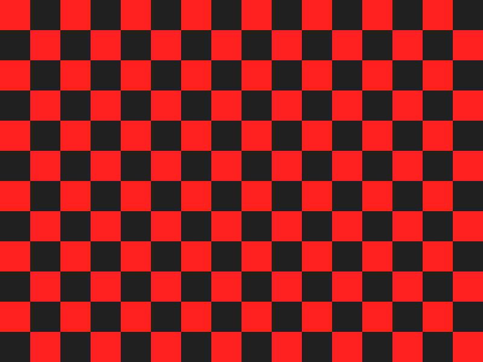

# Olive.c

Simple 2D Graphics Library for C.

## Gallery




## Quick Start

> The truly reusable code is the one that you can simply copy-paste.

The library itself does not require any special building. You can simple copy-paste [./olive.c](./olive.c) to your project and `#include` it. But you may want to build the binary tools for this project that are located in `./bin/`:

```console
$ ./build.sh
```

## How to Use the Library

*This example uses [stb_image_write.h](https://raw.githubusercontent.com/nothings/stb/master/stb_image_write.h) to create the PNG image*

```c
// flag_jp.c
#include "olive.c"

#define STB_IMAGE_WRITE_IMPLEMENTATION
#include "stb_image_write.h"

#define WIDTH 900
#define HEIGHT 600

uint32_t pixels[WIDTH*HEIGHT];

int main(void)
{
    // Taken from https://upload.wikimedia.org/wikipedia/en/9/9e/Flag_of_Japan.svg
    olivec_fill(pixels, WIDTH, HEIGHT, 0xFFFFFFFF);
    olivec_fill_circle(pixels, WIDTH, HEIGHT, WIDTH/2, HEIGHT/2, 180, 0xFF2D00BC);

    const char *file_path = "flag_jp.png";
    if (!stbi_write_png(file_path, WIDTH, HEIGHT, 4, pixels, sizeof(uint32_t)*WIDTH)) {
        fprintf(stderr, "ERROR: could not write %s\n", file_path);
        return 1;
    }
    return 0;
}
```

## Test the Library

```console
$ ./bin/test
```

### Update the test cases

If the expected behaviour of the library has changed in the way that breaks current test cases, you probably want to update them:

```console
$ ./bin/test record
```

## Regenerate the Gallery Above

```console
$ ./bin/gallery
```

## WebAssembly Triangle Example

```console
$ python3 -m http.server 6969
$ iexplore.exe http://localhost:6969/
```
